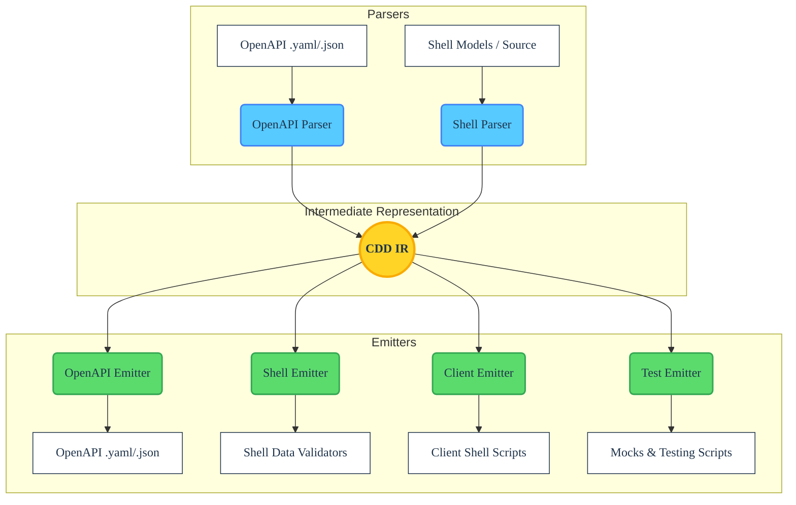

# cdd-sh Architecture

<!-- BADGES_START -->
<!-- Replace these placeholders with your repository-specific badges -->

<!-- BADGES_END -->

The **cdd-sh** tool acts as a dedicated compiler and transpiler. Its fundamental architecture follows standard compiler design principles, divided into three distinct phases: **Frontend (Parsing)**, **Intermediate Representation (IR)**, and **Backend (Emitting)**.

This decoupled design ensures that any format capable of being parsed into the IR can subsequently be emitted into any supported output format, whether that is an API client, a data model class validation script, testing stubs, or an OpenAPI specification.

## 🏗 High-Level Overview

## 🧩 Core Components

### 1. The Frontend (Parsers)

The Frontend's responsibility is to read an input source and translate it into the universal CDD Intermediate Representation (IR). 

For `cdd-sh`, the IR format acts as an `ast.json` file inside the `.gemini/tmp` directory during runtime.

* **Static Analysis**: The shell parsers natively scan `# @function`, `# @param`, `# @class`, and `# @property` annotations leveraging `awk` block-capture logic to securely construct objects representing API definitions, avoiding unsafe runtime executions or `eval` usage.
* **OpenAPI Parsing**: For OpenAPI and JSON Schema inputs, `jq` takes the helm, natively reshaping standard structures into the IR node definitions compatible with the shell generator outputs.

### 2. Intermediate Representation (IR)

The Intermediate Representation is the crucial "glue" of the architecture. It is a normalized, language-agnostic data structure that represents concepts like:
* **Models**: Entities containing typed properties, required fields, and JSON property structures mapped directly to shell validator scripts (`validate_X`).
* **Endpoints / Operations**: HTTP verbs, paths, and complex path/query/body parameter routing. An endpoint holds all needed variables (`BASE_URL`, `curl_args`, `OAUTH_TOKEN`) natively parsed for Shell generation.

By standardizing on a single IR `ast.json`, the system guarantees that parsing logic and emitting logic remain completely decoupled, allowing for bidirectional "round-trip" code-generation.

### 3. The Backend (Emitters)

The Backend's responsibility is to take the universal IR and generate valid target output. 

* **Code Generation**: Emitters use heavily optimized `jq` and `awk` processes to execute templates and shell formatting directly against the parsed AST elements. 
  * A **Data Emitter** (`classes`) creates POSIX shell methods executing deep structural validation loops matching the `schema` types perfectly (supporting array nesting recursion dynamically).
  * A **Client Emitter** (`routes`) constructs `curl` calls wrapping the parameters to conform safely to RFC6570 `style` formats such as `form`, `spaceDelimited`, `pipeDelimited`, `matrix`, and `label`.
* **Surgical Synchronization**: The system heavily relies on `merge.awk`. When an emitter generates a file like `emitted_routes.sh`, `merge.awk` splices the strictly generated AST structures into the pre-existing file without mangling outer whitespace, custom shell methods (`# @custom`), or disconnected logic.

## 🛡 Design Principles

1. **A Single Source of Truth**: Developers should be able to maintain their definitions in whichever format is most ergonomic for their team (OpenAPI files, Shell scripts, Docs) and generate the rest.
2. **Zero-Execution Parsing**: Ensure security and resilience by strictly statically analyzing inputs. The compiler must never need to run the target code to understand its structure.
3. **Lossless Conversion**: Maximize the retention of metadata (e.g., type annotations, docstrings, default values, validators) during the transition `Source -> IR -> Target`.
4. **POSIX Adherence**: By adhering absolutely zero dependencies beyond `jq` and coreutils (`awk`, `sed`), `cdd-sh` stays highly embedded within low-level environments for direct script building.